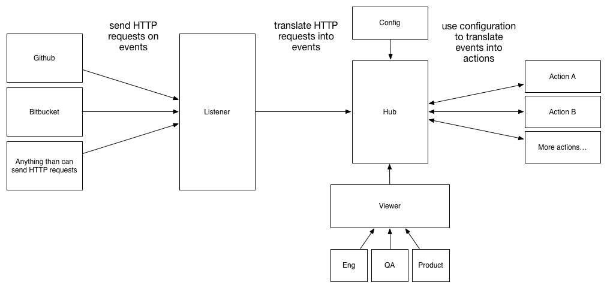

# build-minder

``build-minder`` is a continuous integration utility for listening to webhooks and running builds.

## Development Status

Please be aware that we are very early in development. Our current focus is iterating on goals,
interfaces, architecture and some light prototyping/implementation sketching.

Until we reach a ``1.0`` version we do not intend to make any interface or configuration guarantees,
but given the overall simplicity of what we're trying to accomplish here, it probably won't be a major
issue.

## Why another continuous integration / build tool?

Continuous integration is one of the major enablers for an engineering team or process,
but it's still a bit painful to get started, and there are a handful of pitfalls that
almost every continuous integration rollout encounters (mostly revolving around not
being able to recreate the build server when it inevitably fails or has to be recreated).

``build-minder`` tries to address both of those.

It aims to simplify setup by being minimal and lightweight: it's a single binary whose primary
obligation is to route a webhook to a build script. It should be small and simple enough to
run on your laptop and on your [t1.micro](http://docs.aws.amazon.com/AWSEC2/latest/UserGuide/concepts_micro_instances.html).

Likewise, it aspires to reduce common CI failures by removing common risk vectors.
Rather than allowing editing builds through a UI, you'll only be able to manage them
through configuration files, with an optimized simplest-and-best path of integrating
with a Git repository for storing all configuration and build scripts.

## Guiding Principles for Implementation and Design

There are probably more principles here than strictly useful, but
we can edit down over time. In order of priority they are:

1. **Usability over all else.** Our most important goal is to be easy to install, configure, maintain and use.
    When two goals come into conflict, we should always do the easiest thing for the end user.
2. **Glue, not gunk.** We should actively avoid coupling implementation to specific tools and services.
    (We will consider the tension between decoupling and usability on a feature by feature basis.)
3. **Lightweight to run and install.** You should be able to run it easily on your laptop, within a [Vagrant](http://vagrantup.com/), or on a
    [t1.micro](http://docs.aws.amazon.com/AWSEC2/latest/UserGuide/concepts_micro_instances.html).
4. **Easily recreated build server.** Avoid all forms of transient configuration, as transient configuration is easily lost.
    All configuration (including the build scripts) should come from config files where the canonical copy is stored in remote
    version control (e.g. the build server's configuration files are a duplicate of configuration stored elsewhere,
    and if you lost every piece of configuration on the build server you could simply reclone the canonical repository).
5. **Conversative defaults.** If someone does not modify the defaults, they may not get everything they want, but it should work and should not crash.
    Example: by default we have aggresively truncate the events log rather than try to store a full history because we don't want to run out of disk space
    (which is a fairly common problem in Jenkins deployments).
6. **SOA Aware.** I'm not sure what this really means, but we'll often be running in a SOA environment, and if there are
    any particular considerations that should entail, we'd like to make those considerations.

One can only hope that we won't need even more guiding principles, this is already pretty horrifying.

## Technologies

The current set of technologies used for ``build-minder`` are:

1. [Go](golang.org) - as the general implementation language. Chosen for ability to build small, self-contained binaries with few dependencies, and reasonable performance
    for a mostly asynchronous workload (receiving webhooks, sending webhooks, calling out to shell).
2. [Git](http://git-scm.com/) - is the prefered mechanism for storing configuration and build files.
3. [LevelDB](https://code.google.com/p/leveldb/) - for storing event logs and what not. Not entirely confident in this choice, but basically want something that doesn't require end-user installation
    will compress the data it stores, and doesn't introduce much complexity.

## High-Level Architecture

``build-minder`` is built around two concepts:

1. ``events`` are internal packets for coordinating between components.
2. ``actions`` are triggered by events, usually something like running a bash script.

``events`` and ``actions`` are managed through four components:

1. ``listener`` ingests incoming HTTP requests, translates
    them into events, and then passes them to the ``hub``.
2. ``hub`` receives events and runs any appropriate actions for those events.
3. ``config`` describes actions (e.g. a bash script to run, a webhook to call) and
    the mapping from events to actions.
4. ``viewer`` exposes both an API and HTML webpages for viewing action and event history/status,
    as well as the ability to directly trigger actions.

As long as we keep the configuration formats straight forward, this should really
be a pretty simple project to implement.

## Scenarios to Solve Really Well

Now that we have approaches and a high-level architecture, let's work through the
most common scenarios we are trying to solve for and make sure that we can make
the tool work well.

### Small Team, Private Github Repo, Servers on AWS

In my opinion, this is the most important scenario to solve for,
as it is an extremely common scenario and setting up a solid continuous
integration and deployment solution would do the most good here.

The user story should look like:

1. Setup your organization on Github.
2. Create a private Github repository which contains your ``build-minder`` configuration and build scripts.
3. Create your various other private or public repositories, also on Github.
4. Deploy ``build-minder`` onto an AWS t1.micro, and open up the ``listener``'s HTTP port for incoming connections.
5. Add webhooks to all of your repositories you want ``build-minder`` to integrate with, including your configuration.
6. Bootstrap ``build-minder`` from your configuration repository, including a stock "reload config" action triggered
    whenever you make changes to your ``build-minder`` configuration repository. (Meaning, that going forward
    you will be hands off of your build machine, and only make changes to your configuration which your build
    machine will automatically source into itself. Meaning, all your configuration is always safe and sound in
    a Git repository, not waiting to be lost in a server failure.)
7. Success.

So the major potential areas for pain we need to keep in mind are:

1. Installing ``build-minder`` itself needs to be as simple as possible.
2. Needs to be easy as possible to bootstrap from your configuration repository.
    Should be as simple as checking out your configuration repository in the right place
    with the right directory structure.
3. Would be great if we could add a mechanism which automatically created the webhooks
    instead of having to go create the webhooks ourselves (which is an easy place to screw
    up with a typo, etc).

### Large Team with Alpha, Staging and Production Environments

...

### Local Development using Vagrant

...